# Mask R-CNN
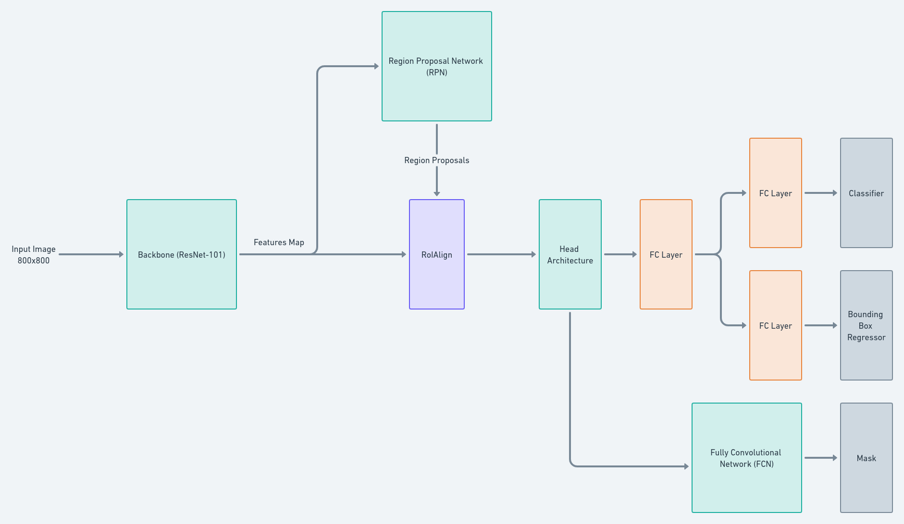
> Mask R-CNN extends Faster R-CNN by adding a branch for predicting segmentation masks on each Region of Interest (RoI), in _parallel_ with the existing branch for classification and bounding box regression. The mask branch is a small **FCN** applied to each RoI, predicting a segmentation mask in pixel-to-pixel manner.

Mask R-CNN is coceptually simple: Faster R-CNN has two outputs for each candidate object, a class label and a bounding-box offset; to this we add a third branch that outputs the object mask.

# Table of Contents
- [Mask R-CNN](#mask-r-cnn)
- [Table of Contents](#table-of-contents)
- [Backbone \[ResNet-101\]](#backbone-resnet-101)
- [Region Proposal Network \[RPN\]](#region-proposal-network-rpn)
  - [Anchors](#anchors)
  - [RPN Loss Function](#rpn-loss-function)
    - [Classification Loss](#classification-loss)
    - [Regression Loss](#regression-loss)
  - [Bounding Box Regression](#bounding-box-regression)
- [RoIAlign](#roialign)
  - [Bilinear Interpolation](#bilinear-interpolation)
  - [RoIAlign Example](#roialign-example)
- [Head Architecture](#head-architecture)
- [Classifier and Bounding Box Regressor](#classifier-and-bounding-box-regressor)
- [Fully Convolutional Network \[FCN\]](#fully-convolutional-network-fcn)
- [Loss Function](#loss-function)

# Backbone [ResNet-101]
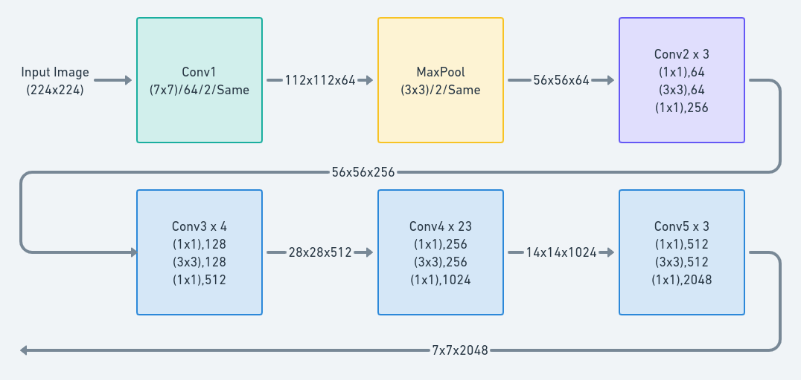
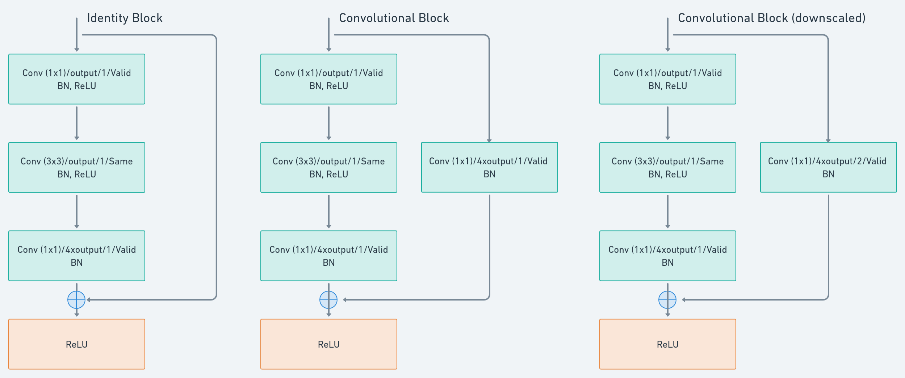
<!-- This backbone with ResNet-101 for example is denoted by ResNet-101-C4. Extracted features from the final convolutional layers of the 4-th stage, which we call C4. -->

# Region Proposal Network [RPN]
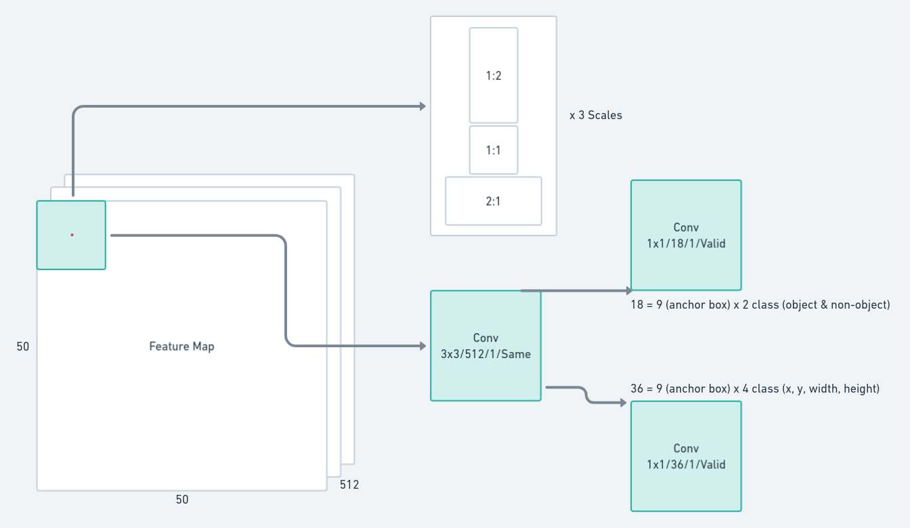
## Anchors
> At each sliding-window location, we simultaneously predict multiple region proposals, where the number of maximum possible proposals at each location is denoted as $k$.
> > The $reg$ layer has $4k$ outputs encoding the coordinates of $k$ boxes
> >
> > The $cls$ layer has $2k$ outputs that estimates probability of object or not object for each proposal.
## RPN Loss Function
$$L(\{p_{i}\},\{t_{i}\})=\dfrac{1}{N_{cls}}\sum_{i}L_{cls}(p_{i},p_{i}^{*})+\lambda\dfrac{1}{N_{reg}}\sum_{i}p_{i}^{i}L_{reg}(t_{i},t_{i}^{*})$$
where:
- $i$ = index of anchor in mini batch
- $p_{i}$ = predicted probability of anchor $i$ being an object
- $p_{i}^{*}$ = 1 if anchor positive, 0 if negative
- $t_{i}$ = vector representing the 4 parameterized coordinates of the predicted bounding box
- $t_{i}^{*}$ = ground truth box associated with positive anchor
 
### Classification Loss
$$L_{cls}$$
is log loss over two classes (object vs not object)

### Regression Loss
$$L_{reg}(t_{i},t_{i}^*)=R(t_{i}-t{i}^*)$$
where:
- $R$ = robust loss function (smooth $L_{1}$)
- $p_{i}^*L_{reg}$ is activated only for positive anchors ($p_{i}^*$=1) and disabled otherwise ($p_{i}^*$=0)

> Output of $cls$ and $reg$ layers consist of $\{p_{i}\}$ and $\{t_{i}\}$ respectively. The two terms are normalized by $N_{cls}$ and $N_{reg}$ and weighted by balancing parameter $\lambda$.

> In our implementation, the $cls$ term is normalized by mini-batch size (_i.e_, $N_{cls}$=256) and the $reg$ term is normalized by the number of anchor locations (_i.e_, $N_{reg}$~2400)

> By default we set $\lambda$ = 10

## Bounding Box Regression
for bounding box regression, we adopt parameterizations of the 4 coordinates following:
$$
t_{x}=\dfrac{x-x_{a}}{w_{a}}, t_{y}=\dfrac{y-y_{a}}{h_{a}},
$$
$$
t_{w}=log(\dfrac{w}{w_{a}}), t_{h}=log(\dfrac{h}{h_{a}}),
$$
$$
t_{x}^{*}=\dfrac{x^{*}-x_{a}}{w_{a}}, t_{y}^{*}=\dfrac{y^{*}-y_{a}}{h_{a}},
$$
$$
t_{w}^{*}=log(\dfrac{w^{*}}{w_{a}}), t_{h}^{*}=log(\dfrac{h^{*}}{h_{a}})
$$
where:

- $x,y,w,h$ = box center coordinates and its width and height.

- $x,x_{a},x^{*}$ are for predicted box, anchor box, and ground truth box respectively (likewise for $y,w,h$)

# RoIAlign
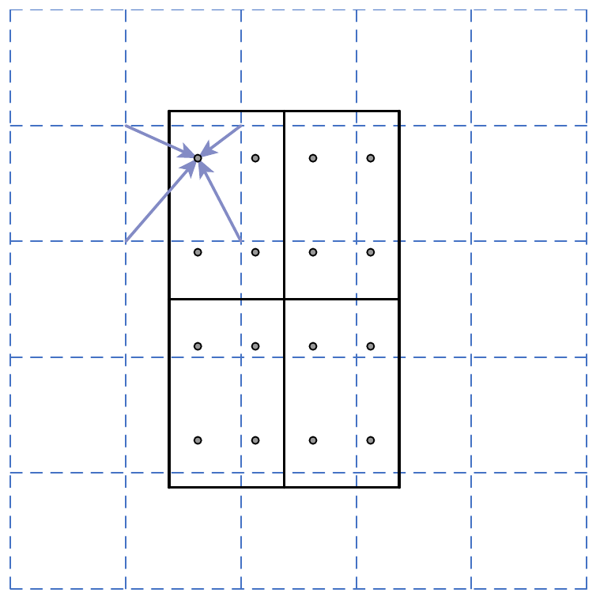
## Bilinear Interpolation
$$
P = \dfrac{y_{2}-y}{y_{2}-y_{1}}(\dfrac{x_{2}-x}{x_{2}-x_{1}}Q_{11}+\dfrac{x-x_{1}}{x_{2}-x_{1}}Q_{21})+\dfrac{y-y_{1}}{y_{2}-y_{1}}(\dfrac{x_{2}-x}{x_{2}-x_{1}}Q_{12}+\dfrac{x-x_{1}}{x_{2}-x_{1}}Q_{22})
$$
## RoIAlign Example
Assume we 16x16 feature map with depth 512 and we want to produce 3x3 Pooling of the RoI so the end result shape is 3x3x512.

Divide the RoI to 9 boxes.

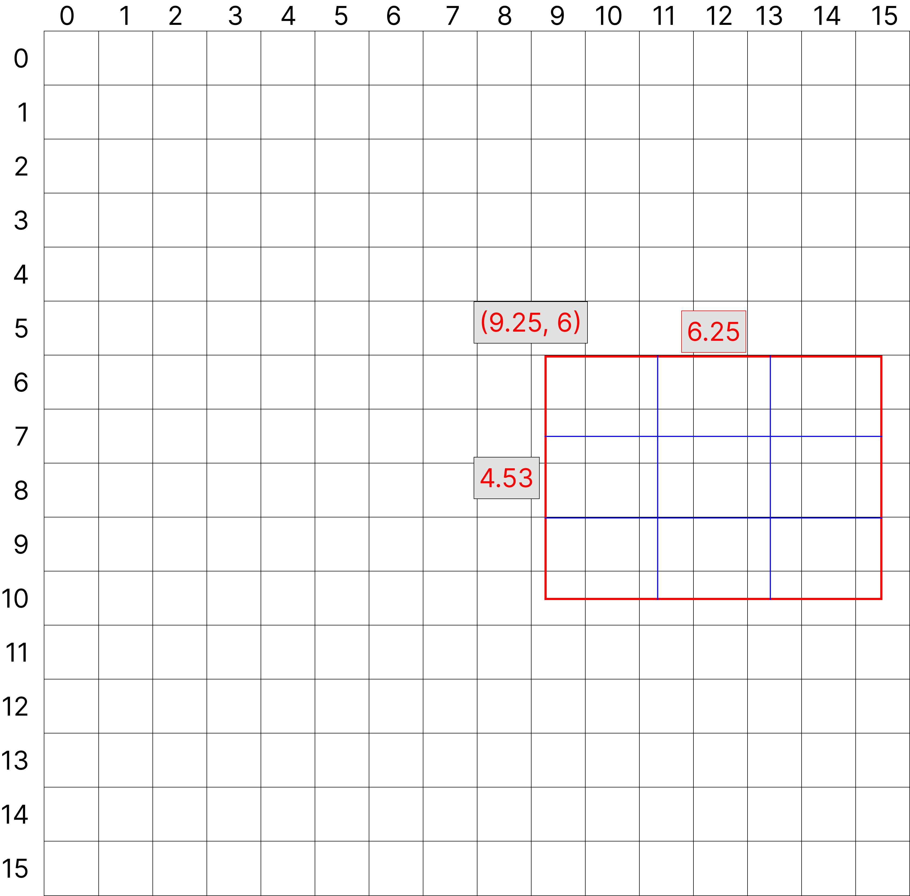

Next, we have to make 4 sampling points of every boxes

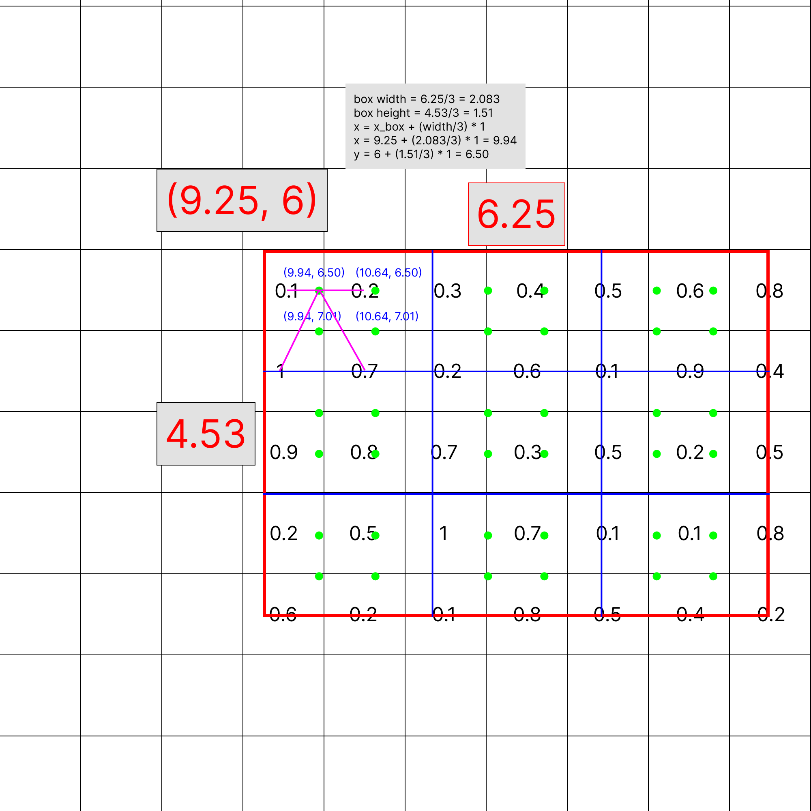

Now to calculate every sampling points value we need to calculate it with bilinear interpolation

$(9.94, 6.50)$:
$$
P = \dfrac{7.5-6.5}{7.5-6.5}(\dfrac{10.5-9.94}{10.5-9.5}0.1+\dfrac{9.94-9.5}{10.5-9.5}0.2) \\ {} \\ +\dfrac{6.5-6.5}{7.5-6.5}(\dfrac{10.5-9.94}{10.5-9.5}1+\dfrac{9.94-9.5}{10.5-9.5}0.7) = 0.14
$$

where:

- $Q_{11}=0.1=(9.5,6.5)$
- $Q_{21}=0.2=(10.5,6.5)$
- $Q_{12}=1=(9.5,7.5)$
- $Q_{22}=0.7=(10.5,7.5)$
- $x=9.94;x_{1}=9.5;x_{2}=10.5$
- $y=6.5;y_{1}=6.5;y_{2}=7.5$

Skip forward, 4 sampling points of top left box achieved
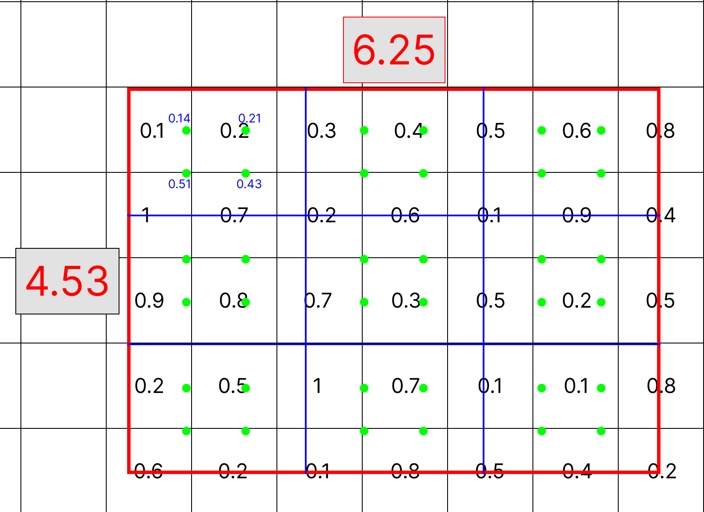

Skip forward, we now get 3x3 MaxPool
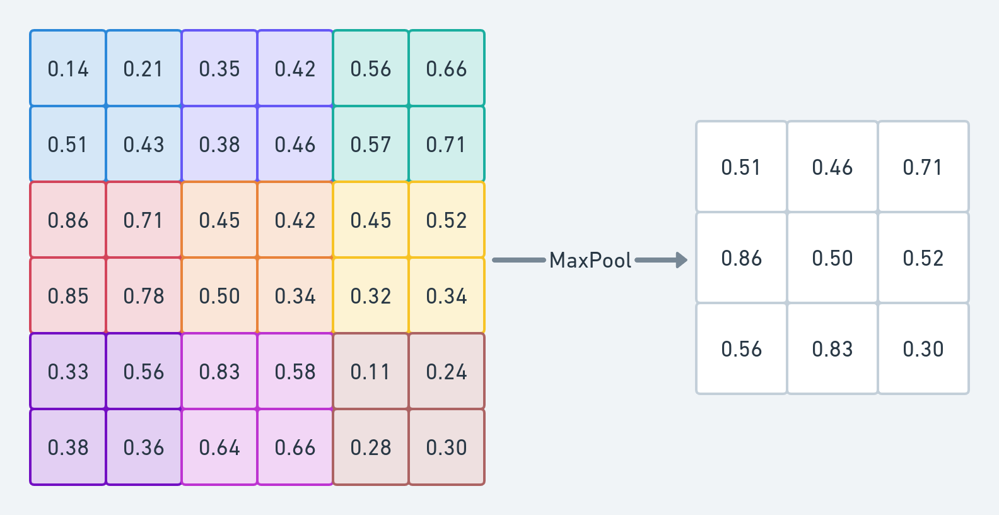

We do this operation until we get desired depth

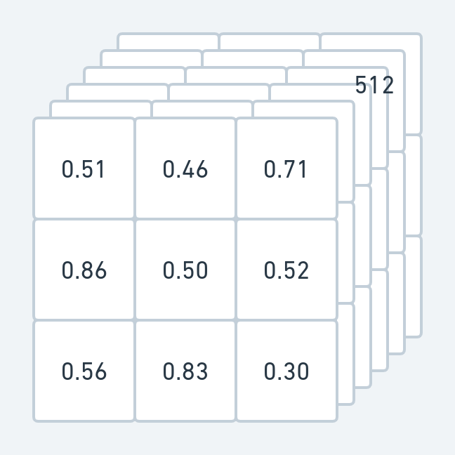

# Head Architecture
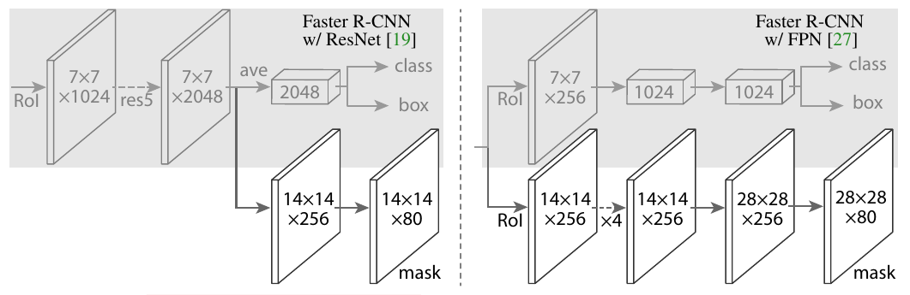
> **Head Architecture**. Number denote spatial resolution and channels. Arrows denote either conv, deconv, or _fc_ layers as can be inferred from context (conv preserves spatial dimension while deconv increases it). All convs are 3x3, except the output conv which is 1x1, deconvs are 2x2 with stride 2, and we use ReLU in hidden layers. Left: 'res5' denotes ResNet's fifth stage, which for simplicity we altered so that the first conv operates on 7x7 RoI with stride 1 (instead of 14x14/stride 2).

For the network _head_ we closely follow architectures presented in previous work to which we add fully-convolutional mask prediction branch. Specifically, we extend the Faster R-CNN box heads from the ResNet. The head on the ResNet-C4 backbone includes the 5-th stage of the ResNet (namely, the 9-layer 'res5')

# Classifier and Bounding Box Regressor

# Fully Convolutional Network [FCN]
> We found it essential to _decouple_ mask and class prediction: we predict a binary mask for each class independently, without competition among classes, and rely on the network's RoI classification branch to predict the category.

We predict an $m$x$m$ mask from each RoI using an **FCN**. This allows each layer in the mask branch to maintain the explicit $m$x$m$ object spatial layout without collapsing it into a vector representation that lacks spatial dimensions.

# Loss Function
[Back to Top:point_up:](#table-of-contents)